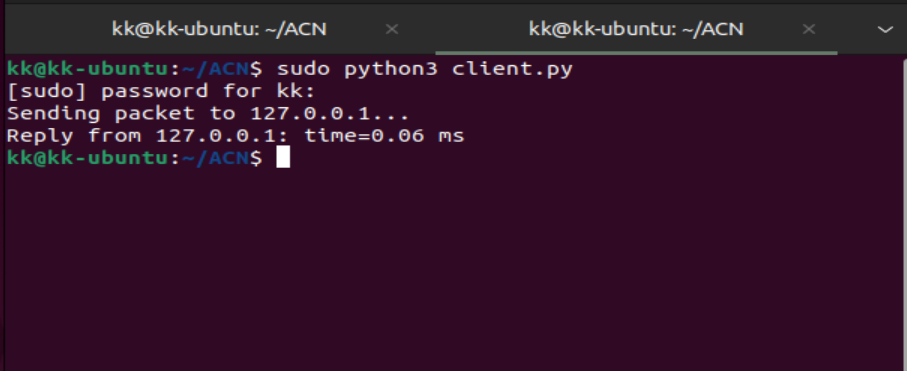
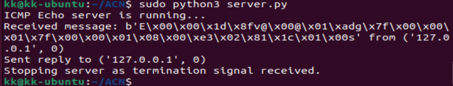

# **Implementing a Smaller Version of PING using ICMP Protocol** - DAIICT(Masters Project)

This project involves the implementation of a simplified version of the PING utility using the ICMP protocol. It demonstrates the process of sending ICMP Echo Requests to a target IP address, calculating the Round Trip Time (RTT), and analyzing network performance.

---

## **Introduction**

The PING utility is a crucial tool in networking, allowing users to test connectivity and measure the delay between systems. This project demonstrates a simplified implementation of PING using ICMP (Internet Control Message Protocol). The ICMP Echo Request and Echo Reply mechanisms are used to exchange packets between the source and destination. Key metrics, such as Round Trip Time (RTT) and packet loss, are calculated for performance analysis. The project was developed with a focus on modular design and cross-platform compatibility (Windows and Linux).

---

## **System Architecture**

The project adopts a modular architecture to ensure clarity and ease of maintenance. The key modules include:

1. **Packet Construction Module**:  
   This module is responsible for constructing ICMP Echo Request packets. It sets fields like Type, Code, Checksum, Identifier, and Sequence Number.  

2. **Transmission Module**:  
   Responsible for transmitting the constructed packets to the target IP address using raw sockets.  

3. **Reception Module**:  
   Listens for ICMP Echo Replies from the target. It parses the response, verifies the packet checksum, and extracts RTT information.  

4. **Error Handling Module**:  
   Manages common errors such as timeouts, packet loss, and corrupted packets. Validates responses and ensures robust error reporting.  

5. **Statistics Module**:  
   Calculates Round Trip Time (RTT), packet loss percentage, and other metrics. Displays the results in a user-friendly format.

---

## **Challenges**

1. Configuring firewall settings to allow inbound and outbound ICMP traffic.

    .png)

    .png)
   
3. Handling indefinite wait times for replies from external servers (e.g., Google's public DNS).

    .png)

5. Ensuring compatibility and proper functionality across different platforms (Windows and Ubuntu-Linux).

   Ubuntu~~ Client - Server
   
     

     
   
7.  Debugging and validating checksum implementation for packet integrity.

---

## **Implementation**

The project implementation involved:  

1. **Packet Creation**:  
   ICMP Echo Request packets were constructed with proper headers and data fields.  

2. **Packet Transmission**:  
   Packets were transmitted to target IP addresses using raw sockets.  

3. **Response Handling**:  
   The script listened for ICMP Echo Replies, parsed the responses, and calculated RTT.  

4. **Error Management**:  
   Timeout and packet loss were detected, and appropriate error messages were generated.  

5. **Testing**:  
   - Local system testing: Simulating PING within the same network.  
   - External server testing: Sending ICMP packets to public servers (e.g., Google's 8.8.8.8).  
   - Cross-platform testing on Windows and Ubuntu-Linux.  

---

## **Results**

The implementation was successfully tested on both local systems and external servers. Key findings include:

- **Round Trip Time (RTT)**:  
  RTT varied based on network conditions and distance to the target server. For Cloud DNS (1.1.1.1), an average RTT of 15ms was observed.

   .png)

- **Packet Loss**:  
  No packet loss was detected in controlled local testing. For external servers, occasional losses were observed due to routing issues.
  As detected in tracert that packet was lost during hops in the attached image.

  .png)

- **Indefinite Wait Time**:  
  This was resolved by implementing timeouts and retry mechanisms for external server requests.

   .png)

The project demonstrated accurate RTT calculations and error handling mechanisms across platforms.  

---

## **Installation**

1. Clone the repository:  
   ```bash
   git clone https://github.com/username/repository-name.git
   cd repository-name
